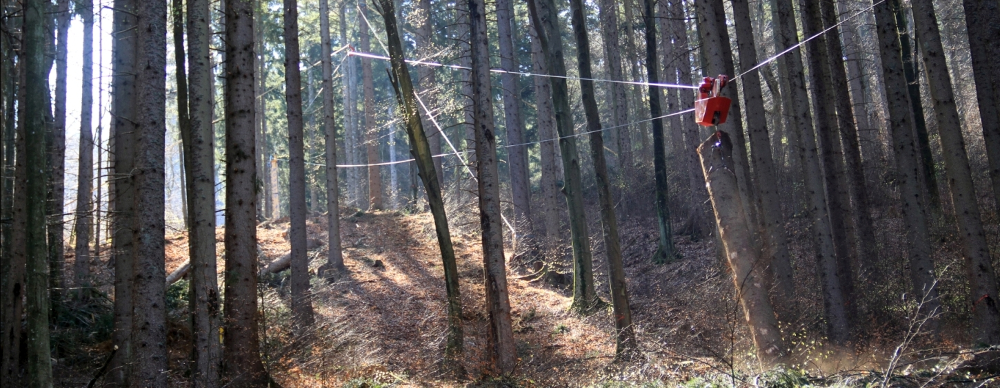
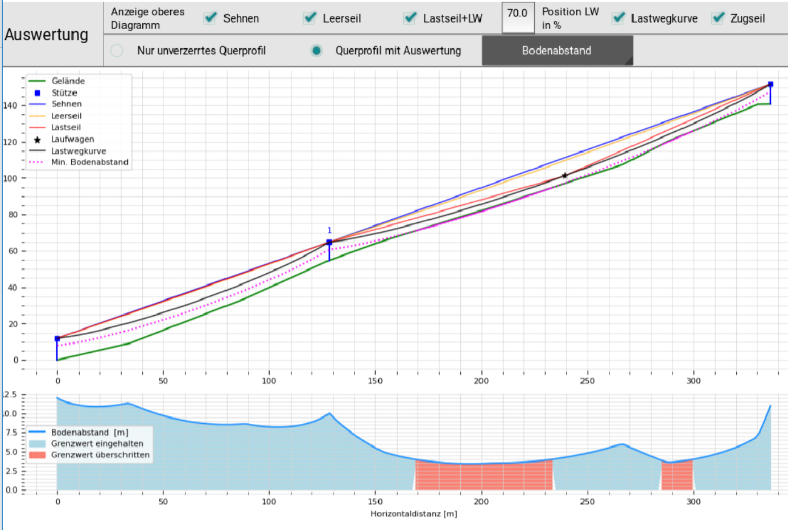

# Präzise Berechnung von Forstseilbahnen mit Catensys

*L. Bont, P. Moll, C. Knobloch*

## Einführung
Catensys dient der Berechnung und Analyse gespannter Drahtseile und Seillinien, insbesondere im Bereich beidseitig fix verankerter Seilbringungssysteme für die Holz- oder Materialbringung. Die Anwendung unterstützt bei der geländeabhängigen technischen Planung, Abschätzung und Kontrolle von Seilverläufen unter definierten Lastannahmen.
Seilgestützte Verfahren bilden das Rückgrat der Logistik für Holz oder Baumaterialien in unwegsamem Gelände. In Mitteleuropa ist der Einsatz von Tragseilsystemen mit vorgespannten, beidseitig fest verankerten Tragseilen sowie Mehrfeldkonfigurationen mit Zwischenstützen weit verbreitet. Für einen sicheren und wirtschaftlichen Aufbau des Seiltrassenbetriebs ist es unerlässlich, die Eigenschaften des Tragseils (z. B. Lastpfad, Zugkräfte) zu bestimmen und zu berechnen. Diese Aufgabe ist anspruchsvoll, da sie das nichtlineare Verhalten der Seilkonstruktion unter Last berücksichtigen und alle wesentlichen physikalischen Effekte einbeziehen muss.

Bislang wurden verschiedene Ansätze als praktische Lösungen vorgeschlagen; diese deckten jedoch nicht alle physikalischen Effekte ab, wie etwa die neigungsabhängige elastische Seildehnung oder die Längsverschiebung des unter Last durchhängenden Laufwagens. Mit dem der SeilApp zu Grunde liegenden Ansatz, welcher alle relevanten physikalischen Effekte berücksichtigt, wollen wir die Seillinienplanung voranbringen. 
Die innovative Berechnungsmethode folgt einem nichtlinearen Ansatz, der die Eigenschaften einer Vielzahl von Tragseilkonfigurationen berechnen lässt, einschließlich solcher mit zusätzlichen Seilen. Dieser Ansatz bietet eine umfassende Lösung sowie einen flexiblen Rahmen, der es ermöglicht, individuelle Konfigurationen oder Besonderheiten durch die Ergänzung des Gleichungssystems zu berücksichtigen. 

Für die Anwendung von Catensys werden folgende Zielgruppe angesprochen: Forstunternehmer mit Seilkraneinsatz, Ingenieur- und Planungsbüros, Forschungseinrichtungen, Sachverständige, Ausbildungsstätten sowie Anwender im Bereich der Planung und Analyse seilgestützter Holzbringungssysteme.	
Entwicklung und Umsetzung

Catensys wurde im Entwicklungszeitraum von 2020 bis 2026 von einem Expertenteam für Seilmechanik und Softwareentwicklung entwickelt. Die für die Software zugrundeliegenden mathematischen Berechnungsmethoden stammen von Leo Bont und Christian Knobloch selbst und können hier nachvollzogen werden: Knobloch C., Bont L. G. (2021): A new method to compute mechanical properties of a standing skyline for cable yarding. PLOS ONE 16(8): e0256374. https://doi.org/10.1371/journal.pone.0256374 

## Entwicklungsteam
Beteiligt bei der Entwicklung von Catensys waren:
  + Patricia Moll (Schweiz): Softwareentwicklung
  + Leo Bont (WSL, Schweiz): Konzept, Methodik, Mechanik, Softwareentwicklung
  + Christian Knobloch (KWF e.V., Deutschland): Konzept, Methodik, Mechanik; Layout
    
## Kontakt 
  + leo.bont@wsl.ch
  + christian.knobloch@kwf-online.de

## Lizenz
Catensys ist unter der Apache License, Version 2.0 lizensiert 
Copyright 2026 Patricia Moll, Leo Bont, Christian Knobloch
Lizenz: http://www.apache.org/licenses/LICENSE-2.0
	
### Diese Software verwendet Open-Source-Komponenten.
Unter anderem:
  + Python (Python Software Foundation License (PSF)
  + Kivy (MIT License)
  + NumPy (BSD 3-Clause License)
  + SciPy (BSD-License)
  + Matplotlib (Matplotlib License)
Die jeweiligen Lizenzbestimmungen liegen der Software bei - siehe third_party_licenses.txt

## Download und Start der Software SeilAPP

Catensys kann von diesem Link aus verwendet werden: 
[Download](https://github.com/ckforst/SeilApp)
 
## Struktur der Software SeilApp
Die Software ist in Tabs gegliedert, die in logischer Reihenfolge durchschritten, aber auch beliebig untereinander befüllt und modifiziert werden können. Jedoch ist für eine Berechnung die vollständige Eingabe der für die Kalkulation benötigten Parameter vonnöten.

### Start
In diesem Tab können Projekte angelegt, gespeichert und geöffnet werden. Zudem lassen sich Projektdaten aus SEILAPLAN importieren. Das Datenformat der SeilApp-Projekte lautet *.json. Zudem sind hier die wesentlichen Informationen über SeilAPP selbst einsehbar (Über SeilApp, Impressum, Haftungsbeschränkung)

### Projekt 
Das Projekt-Tab dient der Organisation des Benutzers und liefert ihm den Projektbezug. Hier können übergeordnete Detailinformationen zur Kennzeichung der konkreten zu berechnenden Seillinie vermerkt werden. Wesentlich ist in diesem Tab die Definition der Transportrichtung bzw. des Standortes des Seilgerätes: talseitig (Transportrichtung bergab bzw. eben) oder bergseitig (Transportrichtung bergauf). Je nach der Eingabe des Geländeverlaufes im folgenden Tab wird dann das Seilgerät an das linke oder rechte Ende der Seillinie gesetzt. 

### Ausrüstung
In Tab „Ausrüstung“ werden die maschinenseitigen Parameter zum Seilgerät und zum verwendeten Laufwagen definiert. Dafür kann mit Hilfe der vorhandenen Vorauswahlliste die üblichen Parameter marktüblicher Systeme ausgewählt und anschließend an die individuellen Begebenheiten angepasst werden. Anhand der Eingabefelder für die Montagespannkraft und die Traglast des Laufwagens kann nach einer erfolgten Berechnung die Situation der Seillinie beim Auftreten von Geländekontakt oder Belastungsüberschreitungen iterativ justiert werden, bis die Komplikationen beseitigt sind. Der Sicherheitsfaktor wird ausrüstungsspezifisch nach den Vorgaben der DIN EN 16517:2021 vorgegeben. 

### Gelände
Im Gelände-Tab wird der zweidimensionale Geländeverlauf bestimmt und zugleich dargestellt. Die X-Achse der Darstellung im unteren Bereich bezieht ich auf den horizontalen Verlauf der Seilinie, die Y-Achse auf deren Höhenänderung im Bezug zum Startpunkt der Seilinie. 
Hier gibt es zunächst zwei grundsätzliche Möglichkeiten der Eingabe des Höhenprofils: in Form eines Polygonzuges oder in Form von Koordinaten. 
Klassisch erfolgt die Aufnahme des Höhenprofils mit Hilfe eines Polygonzuges im Gelände, wobei die einzelnen Polygone mit Angabe des schrägen Abstandes zum Folgepunkt in m sowie mit Angabe des Gefällewinkels, wählbar in Gefälleprozent oder Winkelgrad, eingegeben werden können. Dazu kann die Länge des Polygonzuges mit dem Button „Messung hinzufügen“ erweitert werden. Jeder einzelne Punkt des Polygonzuges kann als Standort eines Ankers oder Bauwerkes bzw. Standort des Seilgerätes definiert werden. Koordinaten bedingen der Eingabe von Rechtswert (Ost-Koordinate), Hochwert (Nord-Koordinate) und zugehöriger Höhenangabe. Ist ein Punkt der Seillinie als Bauerwerk markiert, kann die Bauwerkshöhe und die Bauwerksneigung definiert werden. Alternativ können Geländedaten auch geladen werden. Unterstützt werden folgende Dateiformate: Generische CSV-Dateien mit den Spalten X (Ost-Koordinate), Y (Nord-Koordinate); und Z (Höhe in m). Die Datei darf keine Texte enthalten (ausser in der Kopfzeile) und die Koordinaten müssen in korrekter Reihenfolge vorliegen.
Erfolgte Eingaben werden unmittelbar in der Visualisierung aktualisiert. Der Standort des markierten Objektes (Strecken oder Punkte) wird dabei grafisch durch eine gelbe Markierung hervorgehoben. Markierte Strecken können mit Hilfe des mit „x“ markierten Buttons gelöscht werden. Wichtig ist zu beachten, dass die Verankerung der Seilinie nicht Teil des Geländeverlaufes ist und detailliert in den jeweiligen Tabs „Abspannung Seilgerät“ und „Abspannung Endmast“ vorgenommen wird. 

### Berechnen 
Sind alle nötigen Parameter eingetragen, kann im zentralen Berechnen-Tab die eigentliche Berechnung mit dem gleichnamigen Button in der Kopfzeile gestartet werden. Die relative Position des Laufwagens entlang der Seillinie kann anschließend mit dem nebenstehenden Schieberegler justiert werden, woraufhin die Berechnung aktualisiert wird. Darunter werden die wesentlichen Ergebniswerte der Berechnung als auch eine grafische Visualisierung angezeigt, die mit „Klick“ auf diese maximiert und weiterführend untersucht werden kann. Kritische Berechnungsergebnisse werden entsprechend gekennzeichnet und erklärt. 
Die Berechnung erfolgt unter Anwendung einer eigens entwickelten mathematischen Methodik zur Berechnung von punktbelasteten Katenoiden. Das beidseitig fixierte, durchhängende Seil – eine Kettenlinie (Katenoide) – unter Einzel- oder Mehrfachlast ist ein Element der anspruchsvollen technischen Mechanik und findet Anwendung im Bauwesen, in der Logistik sowie in der Forstwirtschaft. Die Berechnung erfolgt mit Hilfe eines Systems nichtlinearer Gleichungen. Diese Methodik ermöglicht Folgendes:
1. einfache Anpassung an unterschiedliche Einsatzbedingungen durch ein modulares System;
2. Berechnung der Kettenlinie (oder Parabel) für beliebige Positionen und eine beliebige Anzahl von Laufwagen in verschiedenen Mehrfeld-Konfigurationen (anpassbar für die Modellierung von Sonderfällen);
3. Berücksichtigung oder Vernachlässigung wesentlicher physikalischer Effekte und Einflüsse wie Temperatur, Gleiten über Zwischenstützen, Längsverschiebung, Reibung, Zusatzseile, elastische Abspannungen sowie neigungsabhängige Seilelastizität;
4. Ermittlung eines Gleichgewichtszustands zur Bestimmung aller Unbekannten in einem zweistufigen Verfahren;
5. Entwurf einer Tragseilkonfiguration, bei der sich die Auswirkungen einer Änderung von Annahmen oder Randbedingungen einfach darstellen lassen;
6. Beschreibung einer Alternative zum aktuellen mitteleuropäischen Standard für die Berechnung von Tragseilsystemen im Gelände. Diese Methodik ist Grundlage für die Anwendung in dieser Open-Source-Software, die es dem Anwender ermöglicht, Eigenschaften von Tragseilsystemen schnell und leistungsfähig zu entwerfen und zu berechnen.
Bei diesem Ansatz erfordert die Berechnung einer spezifischen Seilkonfiguration die Lösung eines Systems aus mehreren nichtlinearen Gleichungen. Die Lösung des Gleichungssystems erfolgt numerisch bei Verwendung der Kettenlinie und analytisch bei Verwendung der Parabel.

### Auswertung
Dieses Tab liefert erst Ergebnisse, wenn zuvor die Berechnung durchgeführt wurde. Es zeigt zunächst analog zum Berechnen-Tab die berechnete Seilinie in vergrößerter Darstellung. Auch hier kann mit Klick auf die Grafik diese in einem weiteren Fenster maximiert werden. Hier ist es möglich in die Grafik hineinzuscrollen und Koordinaten definierter Punkte auszulesen. Mit den sinnfälligen Icons am oberen Bildrand lässt sich die Darstellung maximieren oder schrittweise zurücksetzen. Im unteren Bereich der maximierten Darstellung kann man das Detailfenster schließen. 
Zurück auf der Hauptansicht des Tabs findet man im oberen Bereich zwei Auswahlzeilen: 
Mittels der oberen Auswahlzeile können Seillinien gezielt hinzugefügt oder ausgeblendet werden, zudem lässt sich die Laufwagenposition gezielt einstellen. Als Parellelkurve der Lastwegkurve lässt sich hier der aus Laufwagen, Lastgehänge und Last resultierende und im Ausrüstungstab definierte Mindestabstand Seil-Boden darstellen und zeigt die kritischen Bereiche zu geringen Abstandes zum Geländeverlauf. Kritische Bereiche werden dabei hervorgehoben. 
In der unteren Auswahlzeile lassen sich im dunkelgrau hinterlegten Auswahlfeld zahlreiche Detailauswertungen finden. Die Darstellung eines gesonderten Diagrammes erfordert die Aufgabe der Unverzerrtheit der Darstellung. So hat man die Wahl die Unverzerrte Darstellung (x- und y-Achse der Darstellung haben den gleichen Maßstab, sind realitätsgetreu) oder die verzerrte Darstellung, bei der die Höhendarstellung gegenüber der Weitendarstellung gestaucht ist, um Platz für das Diagramm zu schaffen. So wird erreicht, dass auch sehr steile Spannfelder möglichst groß und erkennbar dargestellt werden. Die folgenden Auswertungsthemen können nun gewählt werden: 
#### Tragseilzugkraft des Seilgerätes
Hier wird die berechnete Tragseilzugkraft im Seilgerät angezeigt, die vorliegt, wenn der Laufwagen die Seillinie komplett abfährt. Von der Montagespannung ab steigt diese bis zum Maximalwert und sinkt auf den Zwischen- oder Endstützen wieder auf die Montagespannung ab. 
#### Tragseilsicherheit
In dieser Auswertungsdarstellung wird die berechnet Tragseilzugkraft hinsichtlich der Mindestbruchkraft des Tragseiles und der geltenden Sicherheitsbeiwerte ausgewertet und es werden die Bereiche rot markiert, in denen die Grenzwerte überstiege werden. Naheliegend wäre nun die Last des Laufwagens im Ausrüstungs-Tab abzusenken oder die Montagepannung zu vermindern.  
#### Tragseilzugkraft Gegenseite
Die Darstellung erscheint zunächst analog zur Tragseilzugkraft am Seilgerät, jedoch werden hier die Auswirkungen des Höhenunterschiedes gegenüber dem Seilgerät entsprechend berücksichtigt. 
#### Lastwegkurve 
In dieser Darstellung wird die auf die Horizontalachse normierte Lastwegkurve dargestellt und die durch die Laufwagenüberfahrung resultierende vertikale Verschiebung gegenüber der Sehne dargestellt.  
#### Bodenabstand
Hier wird der geländeverlaufunabhängige, aus der Lastwegkurve resultierende Bodenabstand und vor allem diejenigen Bereiche dargestellt, bei der der geforderte Mindestabstand des Tragseiles zum Geländeverlauf nicht eingehalten wird. Durch Einfügen weiterer Bauwerke oder Absenkung des Tragseildurchhanges bei Befahrung können die kritischen Bereiche eliminiert werden. 
#### Tragseildehnung
In dieser Darstellung erkennt man ausgehend von der aus der Montagepannung resultierenden Grunddehnung die bei Laufwagenüberfahrt entlang der Seillinie resultierende Tragseildehnung. 
#### Gedehnte Tragseillänge
Analog vor vorherigen Darstellung wird bei dieser Auswertung die resultierende Gesamtlänge des Tragseiles dargestellt. Der niedrigste Wert wäre die sogenannte Nulldehnung, die auf dem Boden ausliegende ungespannte Länge des Tragseiles. 
#### Laufwagenneigung
Zur Einschätzung des Laufwagenverhaltens an den Spannfeldenden nützt diese Auswertung, die die Neigung des Laufwagens (in Winkelgrad) entlang der gesamten Seillinie aufzeigt. 
#### Laufwagen-Hangabtriebskraft
Die Überwachung der Hangabtriebskraft ist von Bedeutung für die Wahl des Zugseiles und der nötigen Winde. Je steiler das Spannfeld, umso stärker muss die verwendete Zugseilwinde des Seilgerätes sein. Die Maxima der Hangabtriebskraft kann aus diesem Diagramm bequem abgelesen werden. Die jeweilige Stütze kann in der unteren Auswahlzeile gewählt werden. 
#### Resultierende Sattelkraft (Nur bei Vorhandensein Zwischenstütze)
Ist eine Zwischenstütze nötig, ist die am Überfahrsattel resultierende Sattelkraft bzw. der aus ihr abgeleitete Stützendruck ein wesentliches Auslegungskriterium für die Wahl des Sattelbaumes  bzw. des Sattelbauwerks. Die jeweilige Stütze kann in der unteren Auswahlzeile gewählt werden. 
#### Stützendruck (Nur bei Vorhandensein Zwischenstütze)
Der Stützenduck ist die abgeleitete Kraftkomponente der Sattelkraft in vertikale Richtung und dient der konkreten Auswahl der Bauwerke für die Aufnahme eines Überfahrsattels; der Durchmesser an der Bindestelle ist hier bemessend. Die jeweilige Stütze kann in der unteren Auswahlzeile gewählt werden. 
#### Lastseilknickwinkel (Nur bei Vorhandensein Zwischenstütze)
Diese Auswertungsdarstellung dient der Ermittlung des Lastseilknickwinkels, jeweils in den Situation des Laufwagenstandorts unmittelbar vor und nach der Stütze. Der größere Wert gilt als der bemessende. Ist der Knickwinkel zu groß, muss zum Beispiel die Stützenhöhe reduziert bzw. die Seilliniengeometrie modifiziert werden. Die jeweilige Stütze kann in der unteren Auswahlzeile gewählt werden. 
#### Stützenlastneigung (Nur bei Vorhandensein Zwischenstütze)
Die Stützenlastneigung beschreibt die Richtung der Resultierenden aus der Laufwagenüberfahrt über die Stütze und ist Grundlage für die Dimensionierung der Abspannseile des Bauwerks. Die jeweilige Stütze kann in der unteren Auswahlzeile gewählt werden. 
#### Schlupf auf Stütze (Nur bei Vorhandensein Zwischenstütze)
Diesem Auswertungsdiagramm ist zu entnehmen, wieviel Seillänge in m bei der Überfahrt eines Laufwagens über eine Stütze mit in das benachbarte Seilfeld rutschen. Die jeweilige Stütze kann in der unteren Auswahlzeile gewählt werden. 
#### Temperatureinfluss
Dieses Diagramm zeigt die fiktive Auswirkung der Tragseilspannung bei Temperaturabfall oder -anstieg um definierte Temperatursprünge, die in der Kurvenschar dargestellt sind. 
 
### Abspannung Seilgerät
Üblicherweise sind Seilgeräte an natürlichen Ankerbäumen abgespannt. Die Abspannseile des Seilgerätes (einfachere Geräte haben zwei Abspannseile, üblich sind aber vier) müssen dabei die Zugkräfte des Tragseiles von der Mastspitze an die Ankerbäume ableiten. An die Ankerbäume gelten dabei zahlreiche Anforderungen. Sie müssen zunächst ausreichend dimensioniert sein. Ihr Abstand zum Seilgerät muß passen, denn sie dürfen nicht zu nah an diesem stehen um unzulässige Knickwinkel und damit hohe Druckkräfte auf den Mast zu vermeiden, demgegenüber dürfen sie nicht weiter als die Ankerseillänge entfernt stehen. Zudem sollten sie möglichst gleichmäßig beidseitig der Tragseilachse verteilt sein, damit die inneren maßgeblich die Zugkräfte, die Äußeren zudem die Seitenkräfte bei seitlichem Zuzug aufnehmen vermögen. 
Da die Abspannpunkte außerhalb der Trageilachse stehen, sollten diese beim Geländeprofil nicht integriert sein. Im Tab „Abspannung Seilgerät“ können diese nun dezidiert analysiert werden.
Zunächst gilt es im oberen Bereich die Anzahl der Abspannseile sowie (nochmals) die Höhe des Mastes zu definieren. Im darunterliegenden Eingabefeld werden die Standorte der Ankerbäume durch die Eingabe der drei farblich in der nebenstehenden Skizze gekennzeichneten Parameter „schräge Läge entlang Azimut“, „Anstieg“ sowie „seitlicher Abstand“ definiert. Durch Bestätigung der Eingaben mit „Klick“ auf das Feld „Ankerseilkräfte berechnen“ werden im unteren Bereich die Ergebnisse angezeigt. 
Die Ankerseilkraft gibt dabei Anhaltspunkt, ob die Ankerseile ausreichend dimensioniert sind. Dieser Wert ist mit dem normativ festgelegten Sicherheitsbeiwert 4 zu multipliziere und mit der Mindestbruchkraft des Seilzeugnisses zu vergleiche. Die Angabe des benötigten BHD des Ankerbaumes gibt eine näherungsweise Orientierung, ob der Ankerbaum an sich ausreichend dimensioniert ist. Der Abgangswinkel zeigt ob der Ankerbaum zu nah oder zu weit vom Tragseilazimut entfernt steht und der Ankerseilknickwinkel am Mast gibt an, ob der Baum möglichweise zu nah am Seilgerät lokalisiert ist. 

### Abspannung Endmast
Sinngemäß wie die Berechnung der Abspannung des Seilgerätes erfolgt auch die Berechnung der Abspannung des entlang der Seillinie gegenüberliegenden Bauwerkes: dem Endmast. Hier wurde entschieden nur den allgemeinen Fall der Führung des Tragseiles über eine Umlenkrolle direkt zu einem ausreichend dimensionierten Baumanker zu führen. Die Aufteilung des Tragseilendes auf zwei Ankerbäume erfordert das Wissen um die Lage der Aufteilungsstelle, auch sollen die weiteren Abspannungsseile des Bauwerkes des Endmastes hier unberücksichtigt bleiben, da allein die Abspannung des Endmastes berechnet werden soll. 
